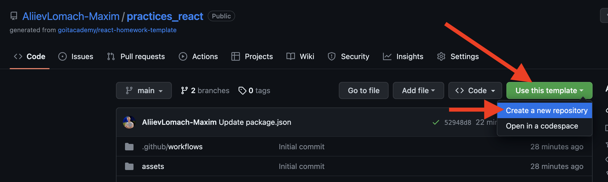
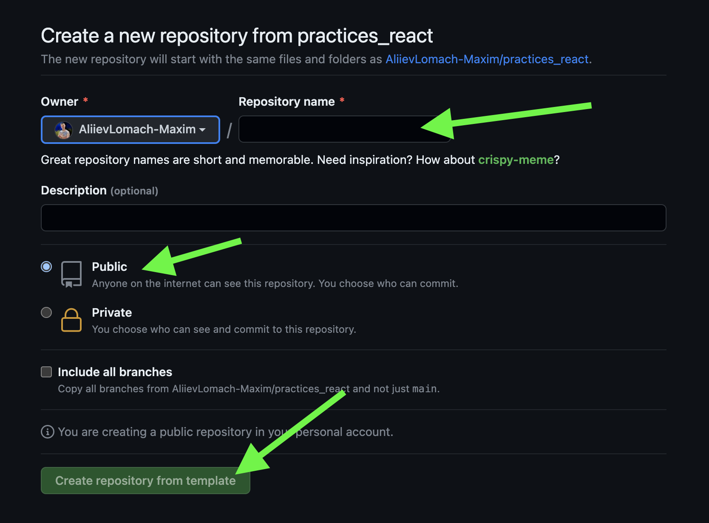

# React practices template

Цей проект було створено за допомогою
[Create React App](https://github.com/facebook/create-react-app). Для знайомства
та налаштування додаткових можливостей
[зверніться до документації](https://facebook.github.io/create-react-app/docs/getting-started).

> Цей проект є демонстраційним прикладом результату, який мають отримати
> студенти під час практики.

> Приклад коду для кожного зайняття лежить у гілці з відповідною назвою:

> Module-(номер модулю)/Less-(номер уроку)

<details>
  <summary>Створення репозиторію за шаблоном</summary>

## Створення репозиторію за шаблоном

Використовуйте цей репозиторій як шаблон для створення репозиторію свого
проекту. Для цього натисніть на кнопку `«Use this template»` та оберіть опцію
`«Create a new repository»`, як показано на зображенні.

 Далі, у
Вас відкриється сторінка створення нового репозиторію. Заповніть поле імені та
переконайтесь, що репозиторій публічний, після цього натисніть кнопку
`«Create repository from template»`.

 Після
того, як репозиторій буде створено, необхідно перейти до налаштувань цього
репозиторію, а саме: `Settings` > `Actions` > `General`, як показано на
зображенні.


Скролимо сторінку до самого низу. Далі, у секції `«Workflow permissions»`
потрібно обрати опцію `«Read and write permissions»` та поставити галочку на
чекбокс. Це необхідно для автоматизації процесу деплоя проекту.


Тепер, Ви маєте власний репозиторій проекту, з такою ж самою структурою файлів
та папок, як на шаблоні. Далі, працюйте з ним, як з будь-яким особистим
репозиторієм, клонуйте його мобі на компʼютер, пишіть код, робіть коміти та
відправляйте їх на GitHub.

</details>
<details>
  <summary>Модуль 1</summary>
  
###
<details>
  <summary>Заняття 1</summary>

### Заняття 1

-   [ ] Створити шаблон проекту з
        [шаблону для ДЗ](https://github.com/goitacademy/react-homework-template#readme)
-   [ ] Налаштувати проект згідно
        [Readme](https://github.com/goitacademy/react-homework-template#readme)
-   [ ] Перевірити деплой
-   [ ] Клонувати проект на ПК
-   [ ] Створити гілку `Module-01/Less-01` для практики

---

-   [ ] Розглянути структуру проекту
-   [ ] Розглянути детально файли `index.js`, `index.css`, `App.jsx`
-   [ ] Почистити файл `App.jsx` щоб він рендерив пустий фрагмент
-   [ ] Відправити файл `users.json` студентам, щоб вони додали його собі.
    > (файл містить масив юзерів, який потрібно зарендерити)
-   [ ] Розглянути файл `users.json`, як виглядає, що містить, що маємо
        зарендерити

---

-   [ ] У файлі `App.jsx`, зробити імпорт `users` з файлу `users.json`
-   [ ] Створити компонент `UsersList.jsx`
-   [ ] Зарендерити компонент `UsersList.jsx` в компоненті `App.jsx`
-   [ ] Передати через пропси `users` з компоненту `App.jsx` </br>в компонент
        `UsersList.jsx`. (далі `компонент 1`)
-   [ ] В `компоненті 1`, отримуємо users за допомогою деструктуризації пропсів
-   [ ] В рендері `компоненту 1`, створюємо `<ul></ul>`, де запускаємо
        </br>метод `map` по масиву `users`.
-   [ ] На кожній ітерації створюємо `<li></li>`, де як текст має бути імʼя
        юреза.
-   [ ] Дивимось результат в браузері. Вікриваємо консоль та обговорюємо
        помилку.
-   [ ] Фіксимо її. Додаємо пропс `key` зі значенням `id` юзера, елементу
        `<li></li>`.
-   [ ] Дивимось результат в браузері.
-   [ ] Створюємо всередені елементу `<li></li>` теги та наповнюємо </br>їх з
        даними юзера, згідно завдання.
-   [ ] Перевіряємо результат.

---

-   [ ] Створюємо новий компонент `User.jsx` (далі `компонент 2`)
-   [ ] Забираємо розмітку, яку повертає метод `map` в `компоненті 1` та
        </br>додаємо її в рендер `компоненту 2`.
-   [ ] Імпортуємо `компонент 2` в `компонент 1`.
-   [ ] Додаємо рендер `компоненту 2` як результат виконання методу `map`.
-   [ ] Передаємо через пропси `компоненту 2` параметр `user` </br>(елемент
        ітерації методу `map`)
-   [ ] Робимо деструктуризацію `user` з пропсів та глибоку деструктуризацію
        всіх необхідних ключів.
-   [ ] Дивимось результат в браузері. Вікриваємо консоль та обговорюємо
        помилку.
-   [ ] Фіксимо її. Додаємо пропс `key` зі значенням `id` юзера, `компоненту 2`.
-   [ ] Дивимось результат в браузері.
-   [ ] Інсталюємо пакет `'prop-types'`
-   [ ] Розписуємо обʼєкт `propTypes` для `компоненту 2`
-   [ ] Розписуємо обʼєкт `propTypes` для `компоненту 1`

---

-   [ ] Виконуємо коміт та пуш в гілку `Module-01/Less-01`
-   [ ] Створюємо `Pull request` на гілку `main`. Мержимо.

---

---

</details>

<details>
  <summary>Заняття 2</summary>
  
### Заняття 2

-   [ ] Створюємо нову гілку `Module-01/Less-02`

---

-   [ ] Створюємо пустий компонент `Section.jsx`
-   [ ] Огортаємо ним компонент `UsersList.jsx` (в рендері `App.jsx`)
-   [ ] Також огортаємо ним рендер компоненту `User.jsx` (тобто елемент
        `<li></li>`)
-   [ ] В компоненті `Section.jsx` додаємо в рендер парний тег
        `<section></section>`
-   [ ] Дивимось результат в браузері.
-   [ ] Оговорюємо зі студентами, яким чином зарендерити компоненти, </br>які ми
        огорнули в `<Section>`. (пропс children)
-   [ ] Додаємо {children} в рендер між тегами `<section>`

```javascript
<section>{children}</section>
```

---

-   [ ] Переходимо в `App.jsx` та передаємо компоненту `Section` пропс
        title='Users List'
-   [ ] В компоненті `Section.jsx` додаємо в деструктуризацію пропс `title`.
-   [ ] Додаємо тег `<h2>` з текстом `title` в середину тегу
        `<section></section>`
-   [ ] Аналізуємо зі студентами ситуцію, що пропс `title` приходить не завжди.
-   [ ] Додаємо рендер за умовою, за допомогою `&&`.

---

> module.css

-   [ ] Створюємо файл `Section.module.css`
-   [ ] В цьому файлі пишемо селектор з невеликою стилізацією (на свій смак) для
        класу `.baseSection`
-   [ ] В компоненті `Section` імпортуємо стилі з `Section.module.css`
-   [ ] Додаємо клас `.baseSection` тегу `<section>`
-   [ ] Дивимось результат в браузері.
-   [ ] У файлі `Section.module.css` створюємо ще один селектор для класу
        `.superSection`
-   [ ] В цьому селекторі необхідно повторити всі стилі з попереднього
        селектору</br> та додати свої, оговорюємо це зі студентами. (`composes`)
-   [ ] Використовуємо `composes` для повторення стилів та дописуємо додатково
        якісь (на власний смак)
-   [ ] В компоненті `Section` обговорюємо зі студентами як зробити
        додавання</br> класу за умою, в залежності від пропсу `title`.

---

> styled-components

-   [ ] Інсталюємо бібліотеку `styled-components@5.3.10`
-   [ ] Створюємо файл `User.styled.js`
-   [ ] Імпортуємо в нього `styled` з бібліотеки `styled-components`
-   [ ] Інсталюємо розширення `vscode-styled-components` (для `VSCode`)
-   [ ] Cтворюємо компонент `Title` для стилізації тегу `<h2>`
-   [ ] Прописуємо елементарні стилі (за смаком)
-   [ ] Імпортуємо `Title` у компонент `User.jsx` та замінюємо ним тег `<h2>`
-   [ ] Дивимось результат в браузері.
-   [ ] Обговорюємо як додати обробку `:hover` на компонент `Title`. Додаємо.
-   [ ] У файлі `User.styled.js` cтворюємо ще один компонент `Text` для
        стилізації тегу `<p>`
-   [ ] Додаємо якусь базову стилізацію (на свій смак)
-   [ ] У компоненті `User` замінюємо тег `<p>`, в якому рендериться
        </br>інформація з `email`, на компонент `Text`.
-   [ ] У файлі `User.styled.js` cтворюємо ще один компонент `NativeText`
        </br>для стилізації тегу `<span>`
-   [ ] У компоненті `User` огортаємо значення `{emeil}` в компонент
        `NativeText`

```javascript
<Text>
    Email: <NativeText>{email}</NativeText>
</Text>
```

-   [ ] Оговорюємо як реалізувати підхід, щоб при наведенні на текст
        `Email:`</br> спрацював `hover-ефект` на компоненті `NativeText`.
-   [ ] Реалізовуємо цю логіку.

---

-   [ ] В компоненті `User` створюємо змінну `isEndedBiz`, </br>в яку заносимо
        результат перевірки - чи закінчується пропс `email` словом `biz`.
-   [ ] Обговорюємо, як в залежності від значення змінної `isEndedBiz` змінити
        колір компоненту `NativeText`
-   [ ] Передаємо компоненту `NativeText` пропс `isEndedBiz`.
-   [ ] В компоненті `NativeText` змінюємо колір тексту в залежності від пропсу
        `isEndedBiz`.

---

-   [ ] Виконуємо коміт та пуш в гілку `Module-01/Less-02`
-   [ ] Створюємо `Pull request` на гілку `main`. Мержимо.

---

</details>

</details>
<details>
  <summary>Модуль 2</summary>
  
###
<details>
  <summary>Заняття 1</summary>

### Заняття 1

-   [ ] Створюємо нову гілку `Module-02/Less-01`

---

-   [ ] Перероблюємо компонент `App` на класовий
-   [ ] Додаємо стейт з ключиком `users`, дефолтним значенням якого,</br> буде
        масив імпортований з файлу `users.json`
-   [ ] Змінюємо передачу пропсів в компонент `UsersList`, з урахуванням стейту.
-   [ ] Додаємо деструктуризацію зі стейту в метод `render`

---

-   [ ] У файлі `Users.styled.js` створюємо стилізований компонент</br>
        `StyledButton` для тегу `<button>`
-   [ ] Додаємо цей компонент в рендер компоненту `User`
-   [ ] Обговорюємо зі студентами логіку реалізації видалення юзера
-   [ ] Створюємо у компоненті `App` метод `deleteUser`
-   [ ] Параметром цей меод має приймати `userId`
-   [ ] Обговорюємо роботу з `setState` від попереднього значення
-   [ ] Викликаємо цей метод та фільтруємо `prevState.users` за умовою
        неспівпадіння по `id`

```javascript
this.setState(prev => ({
    users: prev.users.filter(({ id }) => id !== userId),
}))
```

-   [ ] Передаємо метод `deleteUser` як пропс в компонент `UserList`.
-   [ ] В компоненті `UserList` забираємо пропс `deleteUser` та</br> передаємо
        далі в компонент `User`.
-   [ ] Доповнюємо обʼєкт `propTypes`

---

-   [ ] В компоненті `User` додаємо подію `onClick` на компонент `StyledButton`
-   [ ] Обговорюємо як правильно викликати метод `deleteUser`, щоб передати йому
        `id`
-   [ ] На `onClick` додаємо анонімний кол-бек, де викликаємо </br> метод
        `deleteUser` передаючи йому `id`

```javascript
<StyledButton onClick={() => deleteUsers(id)}>
```

-   [ ] Перевіряємо результат в браузері.

---

-   [ ] У файлі `users.json` додаємо кожному обʼєкту нову властивість
        </br>`hasJob` зі значенням `false`
-   [ ] В уомпненті `User` додаємо в рендер компонент `Text`, де текстом
        </br>буде: `Has Jsob: {hasJob.toString()}`
-   [ ] Додаємо в рендер ще один компонент `StyledButton` з </br>текстом
        `Change job Status`
-   [ ] Обговорюємо реалізацію зміни статусу юзера
-   [ ] Створюємо в компоненті `App` метод `changeUserStatus`
-   [ ] Реалізовуємо логіку зміни статусу
-   [ ] Передаємо цей метод через пропси так як і метод `deleteUser`, </br>в
        компонент `UsersList` потім далі в `User`
-   [ ] По анології з `deleteUser` викликаємо метод `changeUserStatus` </br>по
        кліку на `StyledButton` та передаємо йому `id` юзера
-   [ ] Перевіряємо результат в браузері.

---

-   [ ] Виконуємо коміт та пуш в гілку `Module-02/Less-01`
-   [ ] Створюємо `Pull request` на гілку `main`. Мержимо.

---

</details>

###

<details>
  <summary>Заняття 2</summary>

### Заняття 2

-   [ ] Створюємо нову гілку `Module-02/Less-02`

---

-   [ ] Створюємо новий компонент `Button`.
-   [ ] Цей компонент має рендерити `<button>` з атрибутом `"button"` та</br>
        текстом `{text}`, який ми отримуємо з пропсів.
-   [ ] Також додаємо подію `onClick` яка має викликати метод </br>`handleClick`
        який ми отримуємо з пропсів.
-   [ ] В компоненті `App` імпортуємо компонент `Button` та додаємо в рендер.
-   [ ] Передаємо йому пропс `text` зі значенням `'Open modal'`.
-   [ ] Додаємо новий ключ `isShowForm` в стейт, з дефолтним значенням `false`.
-   [ ] Створюємо функцію `openForm` для зміни цього стейту на `true`.
-   [ ] Передаємо компоненту `Button` пропс `handleClick` </br>значенням якого
        буде ф-я `openForm`

---

-   [ ] Створюємо новий класовий компонент `Form`.
-   [ ] Цьому компоненту в рендері створюємо розмітку для форми.

```javascript
<form>
    <label>Name:
        <input type="text" name="name"/>
    </label>
    <label>Email:
        <input type="email" name="email">
    </label>
    <button>Save</button>
</form>
```

-   [ ] Додаємо компоненту `Form` стейт з ключами `name` та `email`.
-   [ ] Додаємо інпутам атрибут `value` з відповідними значеннями зі стейту.
-   [ ] Cтврюємо метод `handleChange`.
-   [ ] В параметрах цього метода робимо глибоку деструктуризацію </br>для
        значень `name` та `value`.
-   [ ] В методі виконуємо зміну стейту в залежності від значення `name`

```javascript
this.setState({ [name]: value })
```

-   [ ] Імпортуємо компонент `Form` в компонент `App`.
-   [ ] Створюємо рендер за умовою:

```javascript
{
    isShowForm ? <Form /> : <Button />
}
```

---

-   [ ] В компоненті `App` створюємо метод `addUser`, який приймає </br>параметр
        `data`. (це буде обʼєкт з ключами `name` та `email` юзера)
-   [ ] Інсталюємо пакет `nanoid`
-   [ ] В методі `addUser` створюємо обʼєкт `newUser` з такими ключами:
-   [ ] Ключ `id` значенням якого буде результат виклику `nanoid`.
-   [ ] Ключ `isHasJob` зі значенням `false`
-   [ ] Розпилюємо, за допомогою спред оператора в середину обʼєкту
        </br>`newUser` обʼєкт `data` з параметрів ф-ї.
-   [ ] Далі необхідно змінити стейт `users` додавши до нього обʼєкт нового
        юзера `newUser`.

---

-   [ ] Передаємо метод `addUser` компоненту `Form` через пропси.
-   [ ] В компоненті `Form` створюємо метод `handleSubmit`.
-   [ ] В методі реалізовуємо логіку для обробки події `submit`.
-   [ ] Забираємо необхідні значення з `event`
-   [ ] Викликаємо метод `addUser` передаючи йому розпилений стейт.
-   [ ] Повертаємо стейт до дефолтного стану.
-   [ ] Додаємо на форму подію `onSubmit` з методом `handleSubmit`

---

-   [ ] В компоненті `App` створюємо метод `closeForm`
-   [ ] Метод має змінювати стейт `isShowForm` на значення `false`.
-   [ ] Передаємо цей метод як пропс компоненту `Form`
-   [ ] Викликаємо метод `closeForm` в методі `handleSubmit` компоненту `Form`.

---

-   [ ] Інсталюємо бібліотеку `formik`
-   [ ] Створюємо компонент `FormikForm`
-   [ ] Розгортаємо пустий компонент
-   [ ] Переписуємо логіку роботи компоненту `Form` з використанням
        </br>бібліотеки `formik`
-   [ ] По завершенню порівнюємо компоненти та тестуємо в браузері.

---

-   [ ] Виконуємо коміт та пуш в гілку `Module-02/Less-02`
-   [ ] Створюємо `Pull request` на гілку `main`. Мержимо.

---

</details>
</details>
<details>
  <summary>Модуль 3</summary>
  
###
<details>
  <summary>Заняття 1</summary>

### Заняття 1

-   [ ] Створюємо нову гілку `Module-03/Less-01`

---

-   [ ] Необхідно реалізувати логіку збереження користувачів в `localStorage`
-   [ ] В компоненті `App` реалізовуємо метод `componentDidUpdate`
-   [ ] В середені методу реалізовуємо логіку:
    > Якщо додано або видалено користувача, виконуємо запис нових даних в
    > `localStorage`
-   [ ] Для цього додаємо умову:

```javascript
if (prevState.users !== this.state.users)
    localStorage.setItem(USERS_KEY, JSON.stringify(this.state.users))
```

-   [ ] Дивимось результат в браузері, виконуємо декілька дій для зміни та
        оновлюємо сторінку.

---

-   [ ] Обговорюємо зі студентами необхідну подальшу логіку.
-   [ ] Потрібно додати метод `componentDidMount`
-   [ ] В цьому методі потрібно реалізувати логіку зчитування данних з
        `localStorage`
-   [ ] Для цього необхідно спочатку забрати дані з `localStorage` та записати в
        змінну `localData`
-   [ ] Далі перевірити чи в змінній `localData` щось існує.
-   [ ] При позитивному результаті, парсимо данні та записуємо в стейт `users`
-   [ ] Дивимось результат в браузері, видаляємо всіх користувачів. та оновлюємо
        сторінку.

---

-   [ ] Обговорюємо логіку реалізації дефолтного відображення користувачів.
-   [ ] Для реаліації, необхідно розширити умову в методі `componentDidMount`,
        додавши перевірку на довжину масиву з `localStorage`

```javascript
JSON.parse(localData).length > 0
```

-   [ ] Та при негативному результаті, записуємо в стейт дані з файлу
        `users.json`
-   [ ] Також змінюємо дефолтне значення стейту `users` на `null` та додаємо
        рендер за умовою для компоненту `UsersList`

---

-   [ ] Стоврюємо компонент `Modal`
-   [ ] Створюємо файл для компонентів стилізації модального вікна.
    > Можна скинути студентам готовий файл стилізованих компонентів
    > `Modal.Styled.js`
-   [ ] Компонент `Modal` буде приймати обʼєкт `user`
-   [ ] На базі стилізованих компонентів та обʼєкту `user`, будуємо рендер

---

-   [ ] Обговорюємо логіку реалізації відкриття модального вікна
-   [ ] В компоненті `App` додаємо новий стейт `userDetails`
-   [ ] Створюємо новий метод `openDetails`, який приймає обʼєкт `user` та
        записує його в стейт `userDetails`
-   [ ] В компоненті `User` додаємо в рендер ще одну кнопку для відкриття
        детальної інформації.
-   [ ] Передаємо метод `openDetails` пропсами в компонент `User`
-   [ ] Додаємо його на клік відкриття детальної інформації.
-   [ ] В компоненті `App` додаємо рендер компоненту `Modal` за умовою
        `userDetails`
-   [ ] Тестуємо

---

-   [ ] В компоненті `App` створюємо метод `closeDetails`
-   [ ] В методі змінюємо стейт `userDetails` на дефолтний
-   [ ] Передаємо цей метод пропсами в компонент `Modal` та додаємо на подію
        `onClick` на кнопку закриття

---

-   [ ] Виконуємо коміт та пуш в гілку `Module-03/Less-01`
-   [ ] Створюємо `Pull request` на гілку `main`. Мержимо.

---

</details>
<details>
  <summary>Заняття 2</summary>

### Заняття 2

-   [ ] Створюємо нову гілку `Module-03/Less-02`

---

-   [ ] Ціль зайняття - використати запити на бекенд для отримання юзерів
-   [ ] Рекомендуємо використовувати цей
        [Api](https://dummyjson.com 'dummyjson.com')
-   [ ] Знайомимо студентів з Api. Як використовувати, які є запити, що можна
        реалізувати.

---

-   [ ] Даємо завдання релізувати функцію для отримання всіх юзерів.
-   [ ] Для цього, необхідно створити окрему папку `api` поруч з папкою
        `components`, а в ній файл `api.js`
-   [ ] В цьому файлі необхідно створити функцію `getAllUsers`
-   [ ] Функція має робити `GET` запит на бекен для отримання всіх юзерів за
        допомогою бібліотеки `axios`
    > Потрібно інсталювати бібліотеку `axios`
-   [ ] Функція має використовувати `async await`
-   [ ] Функція має повертати деструктуризований обʼєкт `data`

---

-   [ ] В компоненті `App` необхідно видалити імпорт `json файлу` та змінити
        дефолтне значення стейту `users` на `null`
-   [ ] Також необхідно прибрати використання `localStorage`
-   [ ] Далі потрібно реалізувати виклик функції `getAllUsers` в залежності від
        зміни стейту `isShowUsers`
-   [ ] Створюємо метод `handleUsers`
-   [ ] В методі реалізовуємо логіку виклику функції `getAllUsers` за допомогою
        `try catch`
-   [ ] Обговорюємо принцип роботи запиту та необхідність показувати
        користувачеві `Loading` та `Error` якщо він є.
-   [ ] Додаємо два нових стейти `isLoading` та `error`
-   [ ] Робимо деструктуризацію відповіді функції `getAllUsers` та перезаписуємо
        стейт `users`
-   [ ] Далі необхідно в методі `componentDidUpdate` додати виклик методу
        `handleUsers` за умови, що змінився стейт `isShowUsers` і він має
        значення `true`
-   [ ] Додаємо рендер за умовою для стейту `isLoading` та `error`.

---

-   [ ] Далі необхідно реалізувати логіку `Load more`
-   [ ] Для цього додаємо в рендер з `UsersList` компонент `Button`
-   [ ] Обговорюємо зі студентами, що має відбуватись по кліку та як реалізувати
        цю логіку

---

-   [ ] Додаємо новий стейт `page`
-   [ ] Cтворюємо метод `loadMore`, який збільшує стейт `page` на одиницю
-   [ ] Створюємо 2 статичні змінні `limit` та `skip` з дефолтним станом `10`
-   [ ] Розширюємо логіку функції `getUsers`, вона буде приймати 2 параметри
        `skip` `limit`, які будуть передаватись як параметри запиту
-   [ ] Розширюємо логіку функції `handleUsers`, вона буде приймати параметр
        `page`.
-   [ ] Далі необхідно створити формулу для знаходження значення `skip` для
        наступних сторінок.

```javascript
const skip = page * App.skip - App.limit
```

-   [ ] Тепер потрібно передати статичне значення `limit` та локальне значення
        `skip` у виклик функції `getAllUsers`
-   [ ] Також, необхідно переписати зміну стейту `users` враховуючі попередній
        стан та дефолтне значення `null`
-   [ ] Доповнюємо логіку методу `componentDidUpdate`. Додаємо залежність від
        стейту `page` та передаємо `page` аргументом у виклик методу
        `handleUsers`

---

-   [ ] Наступним кроком необхідно реалізувати логіку `hide users`
-   [ ] Для цього в метод `componentDidUpdate` додаємо зміну стейту до
        дефолтного, за умови що `isShowUsers` змінився і має значення `false`

```javascript
this.setState({ page: 1, users: null })
```

---

-   [ ] Виконуємо коміт та пуш в гілку `Module-03/Less-02`
-   [ ] Створюємо `Pull request` на гілку `main`. Мержимо.

---

</details>
</details>

<details>
  <summary>Модуль 4</summary>
  
###
<details>
  <summary>Заняття 1</summary>

### Заняття 1

-   [ ] Створюємо нову гілку `Module-04/Less-01`

---

-   [ ] Метою даної практи є зміна використання класових компонентів на
        функціональні з хуками.
-   [ ] Оговорюємо це зі студентами та розпочинаємо з компоненту `App`

---

-   [ ] У файлі `App.jsx` коментуємо весь класовий компонент та створюємо
        замість нього функціональний.
-   [ ] Все що було в стейті класового компоненту переписуємо з використанням
        хука `useState`
-   [ ] Замість статичних змінних створюємо глобальні
-   [ ] Переписуємо всі мметоди на функції з використанням методів з хука
        `useState` в залежності від назви стейту.
    > setUsers, setIsshowUsers, setIsLoading...
-   [ ] Переписуємо логіку методу `componentDidUpdate` на використання хука
        `useEffect`
-   [ ] Прибираємо використання `this` та `this.state` з `return`

---

-   [ ] Додаємо в `api.js` нову функцію `createUser`, для `POST` запиту на
        створення нового юзера
-   [ ] Переписуємо функцію `addUser` на опрацювання запиту `createUser`
-   [ ] Результат запиту необхідно засетити в існуючий масив юзерів

---

-   [ ] Також переписуємо компонент `FormikForm` на використання хука
        `useFormik`.
-   [ ] Змінюємо класовий компонент `Modal` на функціональний з використанням
        хуків.

---

-   [ ] Виконуємо коміт та пуш в гілку `Module-04/Less-01`
-   [ ] Створюємо `Pull request` на гілку `main`. Мержимо.

---

</details>

<details>
  <summary>Заняття 2</summary>

### Заняття 2

-   [ ] Створюємо нову гілку `Module-04/Less-02`

---

-   [ ] Додаємо в `api.js` нову функцію `searchUser`, для пошуку юзера за імʼям.
-   [ ] Функція має приймати параметр `query` який передається в запит

---

-   [ ] Створюємо новий компонент `SearchForm`
-   [ ] В компоненті має бути реалізована проста контрольована форма на хуках

---

-   [ ] В компоненті `App` створюємо нову функцію `getSearchResult`
-   [ ] Функція має приймати параметр `searchQuery` та робити запит `searchUser`
        з цим парамтером. Результат маємо сетити в стейт `users`
-   [ ] Додаємо в рендер компонент `SearchForm` та передаємо через пропси йому
        функцію `getSerachResult`
-   [ ] В компоненті `SearchForm` створюємо метод `handleSubmit` в якому
        викликаємо метод `getSerachResult` та передаємо йому стейт `searchQuery`

---

-   [ ] В методі `getSerachResult` реалізуємо логіку, якщо пошук не дав
        результатів
-   [ ] У звʼязку з незручністю реалізації повідомлень, додаємо використання
        бібліотеки `react-hot-toast`
-   [ ] Додаємо в рендер компонент `Toaster` імпортований з бібліотеки
-   [ ] Продовжуємо реалізацію логіки пошуку за допомогою методу `toast`
-   [ ] Переписуємо відображення помилок та лоадінга на використання методу
        `toast` (За бажанням)

---

-   [ ] Додаємо логіку `load more` для пошуку
-   [ ] Обговорюємо як це можна реалізувати
-   [ ] Додаємо в компонент `App` новий стейт `searchQuery`
-   [ ] Створюємо новий `useEffect`, який буде слідкувати за стейтом
        `searchQuery` та якщо він `true` то викликатиме метод `getSerachResult`
        передаючи йому стейт `searchQuery`
-   [ ] Тепер необхідно створити окремий метод `handleSearchQuery` для зміни
        стейту `searchQuery`
-   [ ] Передаємо його в компонент `SearchForm` замість пропсу `getSearchQuery`
-   [ ] Додаємо в залежність `useEffect-у` стейт `page` та передаємо його
        аргументом функції `getSearchQuery`
-   [ ] Доповнюємо функціонал методу `getSearchQuery` формулою:

```javascript
const skip = page * SKIP - LIMIT
```

-   [ ] Передаємо функції `searchUsers` додаткові аргументи `skip` та `limit` і
        змінюємо запит використовуючи ці аргументи.

---

-   [ ] Далі потрібно чистити стейт `users` та скидувати значення сторінки при
        новому пошуку.
-   [ ] Для цього додаємо нову умову в `useEffect`:

```javascript
page === 1 && setUsers(null)
```

-   [ ] Та скидуємо значення `page` на `1` у функції `handleSearchQuery`

---

-   [ ] Далі необхідно рендер за умовою для кнопки `Load more...`:

```javaScript
users.length > LIMIT
```

---

-   [ ] Виконуємо коміт та пуш в гілку `Module-04/Less-02`
-   [ ] Створюємо `Pull request` на гілку `main`. Мержимо.

---

</details>
</details>

<details>
  <summary>Модуль 5</summary>
  
###
<details>
  <summary>Заняття 1</summary>

### Заняття 1

-   [ ] Створюємо нову гілку `Module-05/Less-01`

---

-   [ ] Мета практики - додати в проект маршрутизацію
    > npm install react-router-dom

---

-   [ ] У файлі `index.js` огортаємо компонент `App` у компонент `BrowserRouter`
-   [ ] Далі необхідно створити новий компонент `App`
-   [ ] В рендері `App` створюємо перший роут за адресою `'/'`
-   [ ] Елементом даного роуту буде компонент `Layout`, який надалі необхідно
        створити
-   [ ] Компонент `Layout` має рендерити тег `header` чілдреном якого буде
        компонент `Navigate`, який надалі необхідно створити
-   [ ] Комопнент `Navigate` має рендерити наступний шаблон:

```javascript
<nav>
    <ul>
        <li>
            <StyledNavLink to="/">Home</StyledNavLink>
        </li>
        <li>
            <StyledNavLink to="/users">Users</StyledNavLink>
        </li>
    </ul>
</nav>
```

-   [ ] Компонент `StyledNavLink` це має бути стилізований компонент `NavLink` з
        бібліотеки `react-router-dom`

---

-   [ ] В компоненті `App` роут який рендерить `Layout` потрібно зробити парним
        та всередені створити ще 2 роути
-   [ ] Перший роут має бути `Індексним` та рендерити `HomePage`
-   [ ] Другий має мати адресу `'users'` та рендерити `UsersPage`

---

-   [ ] Далі необхідно створити ці компоненти - сторінки в окремій папці `pages`
-   [ ] Компоненти мають рендерити звичайні теги `h1` з назвою сторінки

---

-
-   [ ] Далі в компоненті `Layout` після тегу `header` необхідно додати тег
        `main` в якому в якості чілдрена зарендерити компонент `Outlet`

---

-   [ ] Далі на сторінку `HomePage` необхідно перенести логіку для рендеру
        компоненту `UsersList` зі старого файлу `App copy`
-   [ ] Та потрібно налаштувати запит за юзерами при монтуванні сторінки

---

-   [ ] Далі необхідно в компоненті `User` необхідно змінити логіку кнопки
        `Show Details` на компонент `Link`. Маршрут має вести на `'/users/:id'`
-   [ ] Тепер в компоненті `App` необхідно додати роут для цього маршруту.
        Елементом цього роуту має бути елемент `UserDetailsPage`

---

-   [ ] В компоненті `UserDetailsPage` необхідно реалізувати логіку запиту за
        одним юзером по `id`
-   [ ] Цей `id` необхідно отримати за допомогою хука `useParams`
-   [ ] В рендері має бути компонент `User` який потрібно налаштувати для
        можливості перевикористання

---

-   [ ] Сторінка `UsersPage` має рендерити компонент `SearchForm` та компонент
        `UsersList` з результатами пошуку
-   [ ] Логіку переносимо з компоненту `App copy`

---

-   [ ] Виконуємо коміт та пуш в гілку `Module-05/Less-01`
-   [ ] Створюємо `Pull request` на гілку `main`. Мержимо.

---

</details>
<details>
  <summary>Заняття 2</summary>

### Заняття 2

-   [ ] Створюємо нову гілку `Module-05/Less-02`

---

-   [ ] Мета практики - розширити функціонал використовуючи хуки
        `useSearchParams` `useLocation` `useNavigate`

---

-   [ ] На сторінці `UsersPage` необхідно реалізувати логіку пошуку
        використовуючи адресний рядок
-   [ ] Для цього використаємо хук `useSearchParams`
-   [ ] Метод `setSearchParams` маємо передати через пропси в компонент
        `SearchForm`
-   [ ] В методі `handleChange` компоненту `SearchForm` необхідно викликати
        метод `setSearchParams` передаючи йому такий обʼєкт `{ search: value }`

-   [ ] Далі в компоненті `UsersPage` необхідно створити змінну `searchQuery`
-   [ ] В неї ми маємо за допомогою хука `useMemo` зберегти значення з адресного
        рядку за ключем `search`

```javascript
const searchQuery = useMemo(
    () => searchParams.get('search') ?? '',
    [searchParams]
)
```

-   [ ] Далі метод `handleSearchQuery` більше не отримує ні яких параметрів, а
        функції `setSearch` маємо передати новий аргумент `searchQuery`
-   [ ] Тепер необхідно через пропси передати значення `searchQuery` компоненту
        `SearchForm` та передати його в пропс `value` тегу `input`
-   [ ] Також необхідно очистити адресний рядок коли з інпута все видалено
-   [ ] Для цього можна використати хук `useEffect` в якому передати в метод
        `setSearchParams` пустий обʼєкт коли `searchQuery` пустий

---

-   [ ] Також зі сторінки пошуку ми маємо потрапляти на сторінку детальної
        інформації
-   [ ] Щоб це працювало, необхідно в компоненті `User`, в `StyledLink`, в пропс
        `to` передати значення в залежності від `location.pathname`

---

-   [ ] Далі компоненту `User` маємо додати 2 кнопки для отримання постів та
        туду юзера
-   [ ] Кнопки мають відображатися лише коли ми на сторінці з детальною
        інформацією
-   [ ] По кліку на кнопку `Posts` або `Todos` маємо переходити на вкладений
        маршрут `users/:id/posts | users/:id/todos`
-   [ ] Для цих маршрутів в компоненті `App` потрібно створити вкладені в
        маршрут `users/:id` роути
-   [ ] Вони мають рендерети компоненти `Posts` та `Todos` які надалі необхідно
        створити

---

-   [ ] В компоненті `Posts` потрібно робити запит на отримання всіх постів
        поточного юзера
-   [ ] Для цього необхідно створити новий функцію для запиту в `api.js`
-   [ ] Далі за допомогою `useParams` забрати `id` поточного юзера та передати
        аргументом у функцію запиту
-   [ ] Запит має відбуватися при монтуванні компоненту за допомогою хука
        `useEffect`
-   [ ] Компонент має рендерити список постів

---

-   [ ] Для компоненту `Todos` логіка абсолютно ідентична

---

-   [ ] Тепер компонент `User` має рендерити батон для повернення на попередню
        сторінку
-   [ ] Це має бути саме кнопка. Логіка переходу має бути виконана за допомогою
        хука `useNavigate`
-   [ ] Для того щоб перейти на попередній маршрут маємо забрати значення ключа
        `state` з обʼєкту `location` та передати в метод `navigate`
-   [ ] Також тепер необхідно в компонент `StyledLink` передати в пропс `state`
        обʼєкт `location`

---

-   [ ] Наступне що потрібно зробити, це використати `code-splitting` за
        допомогою `lazy`
-   [ ] Також необхідно видалити всі старі компоненти та код який не
        використовується

---

-   [ ] Виконуємо коміт та пуш в гілку `Module-05/Less-02`
-   [ ] Створюємо `Pull request` на гілку `main`. Мержимо.

---

</details>
</details>

<details>
  <summary>Модуль 6</summary>
  
###
<details>
  <summary>Заняття 1</summary>

### Заняття 1

-   [ ] Створюємо нову гілку `Module-06/Less-01`

---

-   [ ] Необхідно додати використання redux бібліотеки
    > npm i redux react-redux

---

-   [ ] Для початку потрібно дадати два нові роути
-   [ ] Роут за маршрутом `/todos` має рендерити пусту сторінку `TodoPage` яку
        надалі необхідно створити
-   [ ] Роут за маршрутом `create/todos` має рендерити пусту сторінку
        `CreateTodoPage` яку надалі необхідно створити
-   [ ] Також потрібно додати лінки на ці роути в компонент `Navigation`

---

-   [ ] Тепер необхідно створити папку `store`
-   [ ] Далі потрібно створити файл `store.js` та папку `todos`з наступними
        файлами:
-   `actions.js`
-   `selectors.js`
-   `todoReducer.js`
-   `types.js`
-   `initialState.js`

---

-   [ ] У файлі `types.js` створюємо 2 змінні для типів екшенів. `CREATE_TODO`
        та `DELETE_TODO`
-   [ ] Далі необхідно у файлі `actions.js` створити екшени `createTodoAction`
        та `deleteTodoAction`

---

-   [ ] Тепер потрібно створити обʼєкт `initialState` у файлі `initialState.js`
-   [ ] У обʼєкта `initialState` має бути ключ `todo` значенням якого буде
        пустий масив

---

-   [ ] Наступним кроком буде створення редюсера.
-   [ ] У файлі `todoReducer.js` потрібно створити функцію `todoReducer`
-   [ ] Дефолтним значенням параметру `state` має бути імпортований
        `initialState`
-   [ ] Далі, за допомогою `switch`, маємо опрацювати типи екшенів
-   [ ] Типи екшинів маємо імпортувати з файлу `types.js`

---

-   [ ] Переходимо у файл `store.js` та створюємо змінну `store`, значенням якої
        буде результат функції `createStore`, в яку аргументами маємо передати
        `todoReducer`
-   [ ] Далі потрібно у файлі `index.js` огорнути компонент `App` у компонент
        `Provider` з бібліотеки `react-redux`
-   [ ] Компоненту `Provider` маємо передати пропс `store` значенням має бути
        `store` імпортований з файлу `store.js`

---

-   [ ] Сторінка `CreateTodoPage` має редерити контрольовану форму з одним
        інпутом для введення назви туду та кнопкою `Create`
-   [ ] При події `submit` маємо "діспатчити" новий обʼєкт тудушки викликаючи
        екшн `createTodoAction`:

```javascript
{
  id: nanoid(),
  todoName,
  completed: false,
}
```

---

-   [ ] На сторінці `TodoPage` маємо рендерити список туду зі стору
-   [ ] Для цього необхідно створити селектор у файлі `selectors.js`, який буде
        повертати масив туду
-   [ ] На сторінці викликаємо хук `useSelector` якому як аргумент передаємо
        функцію-селектор щойно створену.
-   [ ] Результатом хука `useSelector` буде масив туду який необхідно
        зарендерити
-   [ ] Також має бути кнопка у кожної туду для її видалення
-   [ ] По кліку на цю кнопку маємо "діспатчити" `id` туду на яку клікаємо
-   [ ] В `dispatch` як аргумент передаємо виклик екшену `deleteTodo` передаючи
        йому `id`

---

-   [ ] Виконуємо коміт та пуш в гілку `Module-06/Less-01`
-   [ ] Створюємо `Pull request` на гілку `main`. Мержимо.

---

</details>
<details>
  <summary>Заняття 2</summary>

### Заняття 2

-   [ ] Створюємо нову гілку `Module-06/Less-02`

---

-   [ ] Необхідно додати використання `redux-toolkit`
    > npm i @reduxjs/toolkit

---

-   [ ] В папці `store` створюємо файл `todoSlice.js`
-   [ ] У файлі створюємо змінну `todoSlice` яка буде результатом виклику
        функції `createSlice`
-   [ ] Як аргумент, ця функція має приймати обʼєкт
-   [ ] В обʼєкті прописуємо властивості:
-   `name` > значення `todo`
-   `initialState` > одноіменна властивість з імпортованим `initialState`
-   `reducers` > має бути обʼєктом з методами
-   [ ] Створюємо методи для додавання та видалення туду
-   [ ] В середені методів користуємось привілегіями бібліотеки `immer`
-   [ ] Метод для створення туду має бути реалізований за допомогою `prepare`
-   [ ] В `prepare` маємо перенести логіку створення обʼєкта туду

---

-   [ ] Експортуємо з файлу редюсер `todoReducer` та екшени `createTodo` та
        `deleteTodo`
-   [ ] Змінюємо імпорт у файлі `store` змінюємо файл на використання
        `configureStore`
-   [ ] Тепер змінюємо імпорти у файлах `TodoPage.jsx` та `CreateTodoPage.jsx`
-   [ ] На сторінці `CreateTdooPage` тепер маємо "діспатчити" не новий обʼєкт а
        тільки `todoName`

---

-   [ ] Далі необхідно реалізувати логіку зміни статусу тудушки
-   [ ] Додаємо нову кнопку на сторінку `TodoPage`
-   [ ] Створюємо новий метод в `todoSlice`
-   [ ] "Діспатчимо" `id` по кліку на кнопку зміни статусу

---

-   [ ] Далі необхідно додати використання `redux-persist`
    > npm i redux-persist
-   [ ] Для цього у файлі `store.js` потрібно додати налаштування персісту
        згідно документації
-   [ ] Також потрібно додати в файл `index.js`, компонент `PersistGate` як
        обгортку `App`

---

-   [ ] Виконуємо коміт та пуш в гілку `Module-06/Less-02`
-   [ ] Створюємо `Pull request` на гілку `main`. Мержимо.

---

</details>
</details>

<details>
  <summary>Модуль 7</summary>
  
###
<details>
  <summary>Заняття 1</summary>

### Заняття 1

-   [ ] Створюємо нову гілку `Module-07/Less-01`

---

-   [ ] Необхідно додати використання `createAsyncThunk`
    > Для практики можна використовувати будь-який фейковий API або
    > https://practices-api.vercel.app (swagger: '/api-doc')

---

-   [ ] В папці `store` створюємо нову папку `users`
-   [ ] В цій папці потрібно створити наступні файли: `slice.js` `thunks.js`
        `selectors.js`

---

-   [ ] У файлі `thunks.js` необхідно створити функцію `getAllUsersThunk` за
        допомогою `createAsyncThunk`, яка буде викликати метод з `api.js`
        `getUsers`
-   [ ] Далі у файлі `slice.js` потрібно реалізувати функцію `usersSlice` за
        допомогою методу `createSlice`
-   [ ] Функція має використовувати `extraReducers` та `builder` для опрацювання
        санку
-   [ ] Також потрібно використати підхід з `addMatcher`
-   [ ] З цієї функції необхідно експортувати редюсер та додати його у файл
        `reducer.js`

```javascript
export const usersReducer = usersSlice.reducer
```

-   [ ] Після цього потрібно написати функцію - селектор, для отримання юзерів,
        у файлі `selectors.js`

---

-   [ ] Далі необхідно оновити компонент `HomePage` з використанням
        `useDispatch` та `useSelector`
-   [ ] Для цього необхідно замінити використання `useState` на отримання данних
        зі стору за домогою `useSelector`
-   [ ] Далі, замість виклику `getUsers` маємо викликати `getAllUsersThunk` за
        допомогою `dispatch`
-   [ ] Також необхідно змінити опрацювання помилки та loading.

---

-   [ ] Якщо Ви використовували `https://practices-api.vercel.app` необхідно
        усюди, де використовується `id` юзера змінити це поле на `_id`
-   [ ] А також змінити отримання пагінації. Замість значення `skip` маєте
        відправляти `page` з номером сторінку, яку бажаєте отримати

---

-   [ ] Також сторінки `TodoPage` та `CreateTodoPage` більше нам не
        знадобляться, тому можна видалити їх та все що з ними повʼязано.

---

-   [ ] Виконуємо коміт та пуш в гілку `Module-07/Less-01`
-   [ ] Створюємо `Pull request` на гілку `main`. Мержимо.

---

</details>

###

<details>
  <summary>Заняття 2</summary>

### Заняття 2

-   [ ] Створюємо нову гілку `Module-07/Less-02`

---

-   [ ] Необхідно додати форму для фільтрації юзерів за імʼям або номером.
-   [ ] Фільтрація має працювати через `redux` та з використанням хука
        `useSearchParams`

---

-   [ ] Для цього потрібно створити новий компонент `FormFilter` у папці `Form`
-   [ ] Цей компонент має отримувати з пропсів метод `setFilterParams` та
        параметр `filterQuery`
-   [ ] На інпут необхідно повісити слухач `onChange` який має викликати функцію
        `handleChange`
-   [ ] Функція `handleChange` має викликати метод `setFilterParams` і
        передавати в нього обʼєкт зі значенням інпуту.

```javascript
setFilterParams({ filter: value })
```

---

-   [ ] Далі в папці `store/users`, у файлі `selectors.js` необхідно змінити
        функцію-селектор.
-   [ ] Ця функція, використовуючи метод `createSelector`, має фільтрувати
        юзерів в залежності від значення `filter` зі стейту. Та має повертати
        обʼект з полями `isLoading,users,error..etc`

---

-   [ ] Далі в компоненті `HomePage` за допомогою хука `useSelector` необхідно
        забрати `filter` та нові дані обʼєкту юзер
-   [ ] Після цього маємо забрати значення та функцію з хука `useSearchParams`

```javascript
const [query, setFilterParams] = useSearchParams()
```

---

-   [ ] Далі потрібно створити змінну `filterQuery`, значенням якої буде
        мемоізоване значення:

```javascript
const filterQuery = useMemo(() => query.get('filter'), [query])
```

---

-   [ ] Після цього маємо записати значення фільтру в стор
-   [ ] Це виконуємо за допомогою хуків `useEffect` та `useDispatch`
-   [ ] А також необхідно зарендерити компонент `FormFilter` та передати йому
        необхідні пропси

---

-   [ ] Виконуємо коміт та пуш в гілку `Module-07/Less-02`
-   [ ] Створюємо `Pull request` на гілку `main`. Мержимо.

---

</details>
</details>

<details>
  <summary>Модуль 8</summary>
  
###
<details>
  <summary>Заняття 1</summary>

### Заняття 1

-   [ ] Створюємо нову гілку `Module-08/Less-01`

---

-   [ ] Необхідно релізувати реєстрацію та авторизацію користувача

    > Для практики можна використовувати будь-який фейковий API або
    > https://practices-api.vercel.app (swagger: '/api-doc')

---

-   [ ] Для цього необхідно створити 2 нові сторінки `SignInPage` та
        `SignUpPage`
-   [ ] Ці сторінки будуть рендерити форми для авторизації та реєстрації.

---

-   [ ] Тепер необхідно створити 2 компоненти `FormLogin` та `FormRegistration`
-   [ ] Ці компоненти мають рендерити форми для авторизації та реєстрації.
-   [ ] Форми мають бути реалізовані за допомогою бібліотеки `formik`
-   [ ] Та має бути реалізована валідація цих форм за допомогою бібліотеки `Yup`
-   [ ] Компоненти `FormLogin` та `FormRegistration` мають бути `stateless`
        компонентами
-   [ ] По можливості (в залежності від групи та часу), має бути реалізована
        стилізація цих компонентів
    > Сторінка авторизації повинна мати посилання для переходу на сторінку
    > реєстрації і навпаки. Також має бути посилання на домашню сторінку

---

-   [ ] Далі необхідно створити функції-запити для авторизації та реєстрації
-   [ ] Має бути реалізована логіка додавання та видалення токену з `axios`

---

-   [ ] Далі необхідно реалізувати стор
-   [ ] Для цього, в папці `store` створюємо папку `auth`, в якій створюємо
        файли `slice.js`, `thunks.js`, selectors.js`
-   [ ] Далі реалізовуємо функції `loginThunk` та `signupThunk` за допомогою
        методу `createAsyncThunk`

---

-   [ ] Наступним кроком буде реалізація слайсу
-   [ ] `authSlice` має бути реалізований з використанням `addMatcher`
-   [ ] Також необхідно беде реалізувати синхронний екшн `logOut`, який має
        чистити стейт
-   [ ] Після цього потрібно у файлі `selectors.js` реалізувати функцію-селектор
        для отримання обʼєкту `auth`

---

-   [ ] Далі в компонентах `SignInPage` необхідно реалізувати метод
        `handleSubmit`, який має приймати параметр з даними форми та діспатчити
        їх
-   [ ] Також потрібно додати `useEffect` для навігації на `HomePage` якщо є
        токен (тобто, при успішній авторизації)
-   [ ] Ще потрібно реалізувати відображення помилки при невдалій авторизації
        (Стиль відображення на власний розсуд)
-   [ ] Після цього необхідно пропсами передати метод `handleSubmit` компоненту
        `FormLogin`, в якому викликати цей метод при події `onSubmit` на
        компоненті `Formik`

---

-   [ ] По аналогії з `SignInPage` маємо виконати ті самі дії для компоненту
        `SignUpPage`

---

-   [ ] Далі в компоненті `Navigation` потрібно додати нове посилання на
        сторінку авторизації
-   [ ] Це має бути динамічне посилання, яке буде змінюватись з `Log In` на
        `Log Out` в залежності від значення `token`
    > Рендер за умовою
-   [ ] При кліку на `Log Out` маємо діспатчити синхронний екшн `logOut`,
        реалізований раніше в слайсі. А також видаляти токен з `axios`

---

-   [ ] Наступний крок реалізація компоненту `Profile`
    > Може бути реалізована на власний розсуд
-   [ ] Необхідно створити компонент `Profile`, який пропсами буде приймати
        обʼєкт `profile`
-   [ ] Цей компонент буде рендеритися в компоненті `HomePage` в залежності від
        обʼєкту `profile`, який ми отримаємо зі стору за допомогою хука
        `useSelector`
-   [ ] При рендері компоненту `Profile` необхідно пропсами передати йому обʼєкт
        `profile`
-   [ ] Компонент `Profile` має рендерити всю детальну інформацію про
        користувача

---

-   [ ] Виконуємо коміт та пуш в гілку `Module-08/Less-01`
-   [ ] Створюємо `Pull request` на гілку `main`. Мержимо.

---

</details>

###

<details>
  <summary>Заняття 2</summary>

### Заняття 2

-   [ ] Створюємо нову гілку `Module-08/Less-02`

---

-   [ ] Необхідно релізувати використання `refresh` зі збереженням авторизації
-   [ ] Реалізувати логіку приватних та публічних роутів
-   [ ] Додати сторінку профайлу з можливістю редагування даних авторизованого
        користувача

    > Для практики можна використовувати будь-який фейковий API або
    > https://practices-api.vercel.app (swagger: '/api-doc')

---

-   [ ] Для реалізації `refresh` необхідно спочатку реалізувати збереження
        токену в `localStorage`
-   [ ] Це потрібно зробити у файлі `auth.js` після отримання токену у функціях
        `signup` та `login`
-   [ ] Далі потрібно створити новий post-запит на валідацію токена та отримання
        профайлу.
-   [ ] Функція має отримувати токен, далі додавати його до хедеру запиту та
        після отримання нового токену сетити його в хедери.

---

-   [ ] Викликати та обробляти цю функцію маємо через `redux`
-   [ ] Тому маємо створити новий санк та обробити його в `authSlice`

---

-   [ ] Викликати новий санк будемо в компоненті `Layout` за допомогою
        `useEffect` та передаватимемо в нього токен отриманий з `localStorage`

```javascript
!token && localToken && dispatch(refreshThunk(localToken))
```

-   [ ] Наступним кроком буде реалізація приватних та публічних роутів.
-   [ ] Для цього необхідно створити папку `guards` та в ній створити 2
        компоненти `AuthGuard` та `GuestGuard`
    > Або PrivateRoute та PublicRoute
-   [ ] В компонентах реалізовуємо логіку в залежності від токену зі стору.
-   [ ] Далі переходимо в компонент `App` та робимо приватним компонент
        `UserDetailsPage`
-   [ ] А компоненти `SignInPage` та `SignUpPage` публічними

---

-   [ ] Далі потрібно створити окрему сторінку `ProfilePage` та компонент
        `Profile`
-   [ ] Компонент `Profile` реалізовуємо за власним бажанням
-   [ ] Це має бути компонент з детальною інформацією про авторизованого
        користувача
-   [ ] Сторінка `ProfilePage` має рендерити форму реалізовану через `formik`
        для оновлення детальної інформації про авторизованого користувача
-   [ ] Також сторінку `ProfilePage` необхідно огорнути в приватний роут

---

-   [ ] Якщо Ви використовували в слайсах такий підхід:

```javascript
.addMatcher(
                action => action.type.endsWith('/pending'),
                handlePending
           )
```

-   [ ] Необхідно показати та використати логіку окремого слайсу для помилок та
        лоадінга.
-   [ ] В результаті використання окремого стору створити окремі копненти
        `Loader` та `Error`
-   [ ] Їх необхідно зарендерити в компоненті `App` (рендер за умовою)
-   [ ] Таким чином можна видалити використання `error` та `isLoading` з усіх
        останніх файлів

### Наступна логіка виконується в залежності від часу та побажань студентів

-   [ ] Необхідно реалізувати додавання коментарів до постів.
-   [ ] Це може виконати тільки авторизований користувач
-   [ ] Коли ми показуємо всі пости якогось юзера, під кожним постом має бути
        кнопка яка покаже всі коментарі до саме цього поста.
-   [ ] Для цього необхідно створити окремий запит на отримання коментарів по
        `id` посту
-   [ ] Опрацювати цей запит через санк.
-   [ ] Створити окремий компонент для `PostDetails` в якому виконати рендер за
        умовою для коментарів саме цього поста.
-   [ ] Також в компоненті `PostDetails` необхідно додати форму для додавання
        нового коментаря
-   [ ] Для цього також потрібен новий запит та санк.
-   [ ] Також при успішному додаванні коментаря необхідно зробити повторний
        запит на отримання всіх коментарів.
    > Можна використати підхід unwrap()

---

### Наступна логіка виконується в залежності від часу та побажань студентів

-   [ ] Можна показати студентам використання бібліотеки `mui`
-   [ ] можна переписати декілька компонентів або ж якщо є можливість виділити
        час та переписати весь проект на `mui` показуючи всі можливості
        бібліотеки.
-   [ ] В гілці `main` остання версія проекту реалізована на `mui`.
-   [ ] Можна її використовувати як приклад, показати код та реалізацію
        компонентів.

---

-   [ ] Бажано почистити всі файли від коментарів та видалити все що не
        використовується

---

-   [ ] Виконуємо коміт та пуш в гілку `Module-08/Less-02`
-   [ ] Створюємо `Pull request` на гілку `main`. Мержимо.

---

</details>
</details>
